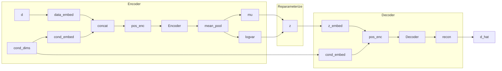

# TCVAE（Transformer 条件变分自编码器）设计说明

本文档简要、清晰地介绍 $TCVAE.py$ 的网络结构与各模块设计，覆盖数据/条件的编码方式、Transformer 编解码器、潜变量采样与损失函数，并附上结构示意图与关键源码片段引用，便于快速理解与复用。

## 总览
- 任务：学习条件分布 $p(d \mid c)$，其中 $d$ 为距离特征（一般为标量），$ c$ 为条件（如初始关节角 $q_0$ 与工作空间索引 $x_{idx}$ ）。
- 架构：以 Transformer 取代传统 MLP，构建条件 VAE。
	- 编码器：将 $[d, c]$ 组成 token 序列，经 Transformer Encoder 输出 $\mu, \log\sigma^2$。
	- 解码器：将 $[z, c]$ 组成序列，使用 Transformer Decoder 重建 $d$ 。
- 关键思想：
	- 条件的每个维度被视为一个独立 token，经线性嵌入与（可选）位置编码后，供注意力机制建模条件维度之间的关系。
	- <font color='red'>序列聚合使用均值池化得到全局表示，再投影为潜变量分布参数。</font>



## 模块设计

### 1. 位置编码 PositionalEncoding
- 作用：为序列 token 注入位置信息；实现为标准正弦-余弦位置编码。
- 接口：输入 `(B, seq_len, embed_dim)` ，输出同形状。

引用：
```python
class PositionalEncoding(nn.Module):
		def __init__(self, embed_dim, max_len=100, dropout=0.1):
				...
				pe[:, 0::2] = torch.sin(position * div_term)
				pe[:, 1::2] = torch.cos(position * div_term)
				self.register_buffer('pe', pe.unsqueeze(0))
		def forward(self, x):
				x = x + self.pe[:, :x.size(1), :]
				return self.dropout(x)
```

### 2. 编码器（Encoder）
- 输入组成：将 `data` 作为 1 个 token，将条件 `condition` 的每个维度各自作为 1 个 token，拼接为长度为 `1 + condition_dim` 的序列。
- 嵌入层：
	- `data_embed: Linear(1 -> embed_dim)` 将标量 $d$ 嵌入为 token。
	- `condition_embed: Linear(1 -> embed_dim)` 将条件的每个维度嵌入为独立 token（通过 `unsqueeze(-1)` 后逐维线性映射）。
- TransformerEncoder：
	- `nn.TransformerEncoderLayer(d_model=embed_dim, nhead=num_heads, dim_feedforward=ff_dim, activation='gelu', batch_first=True)` 
	- 堆叠 `num_encoder_layers` 层，并在末尾施加 `LayerNorm` 。
- 聚合与投影：对 encoder 输出序列做均值池化，再分别用 `fc_mu` 与 `fc_logvar` 投影得到 $\mu$ 与 $\log\sigma^2$。

引用：
```python
encoder_input = torch.cat([data_token, condition_tokens], dim=1)
encoder_output = self.transformer_encoder(encoder_input)
aggregated = encoder_output.mean(dim=1)
mu = self.fc_mu(aggregated)
logvar = self.fc_logvar(aggregated)
``` 

### 3. 重参数化（Reparameterize）
- 公式：$z = \mu + \sigma \cdot \epsilon$，其中 $\epsilon \sim \mathcal{N}(0, I)$。
- 目的：使采样过程可导，从而端到端训练。

引用：
``` python
std = torch.exp(0.5 * logvar)
eps = torch.randn_like(std)
z = mu + eps * std
``` 

### 4. 解码器（Decoder）
- Query（目标）：将 $z$ 视为 1 个查询 token，经 `latent_embed: Linear(latent_dim -> embed_dim)` 映射。
- Memory（条件）：与编码器一致，将条件各维度作为 memory token 输入 TransformerDecoder。
- 位置编码：可选，对 query 与 memory 序列分别加位置编码。
- TransformerDecoder：
	- `nn.TransformerDecoderLayer(d_model=embed_dim, nhead=num_heads, dim_feedforward=ff_dim, activation='gelu', batch_first=True)`
	- 堆叠`num_decoder_layers`层，并在末尾施加 `LayerNorm` 。
- 输出投影：仅使用解码器输出的第一个 token，经 `output_proj: Linear(embed_dim -> data_dim)` 预测距离 $d_recon$ 。

引用：
``` python
decoder_output = self.transformer_decoder(tgt=z_token, memory=condition_tokens)
data_recon = self.output_proj(decoder_output.squeeze(1))
``` 

## 前向与采样

### `forward(data, condition)` 
- 流程：`encode -> reparameterize -> decode` ，返回 `(data_recon, mu, logvar)` 。

### `sample(condition, n_samples)` 
- 从先验 $z \sim \mathcal{N}(0, I)$ 采样，在给定条件下解码得到多个距离样本。
- 支持批量条件与单个条件输入，自动扩展维度并重整形后返回。

引用：
``` python
z = torch.randn(batch_size, n_samples, self.latent_dim)
condition_expanded = condition.unsqueeze(1).expand(-1, n_samples, -1)
data_flat = self.decode(z.reshape(-1, latent_dim), condition_expanded.reshape(-1, condition_dim))
data_samples = data_flat.reshape(batch_size, n_samples, data_dim)
``` 

## 损失函数与训练要点

### $loss_function(data_recon, data, mu, logvar, beta=1.0)$ 
- 重建损失：MSE（适合回归型距离预测）。
- KL 散度：$\mathrm{KL}(\mathcal{N}(\mu, \sigma^2) \parallel \mathcal{N}(0, I))$。
- 总损失：$\mathrm{loss} = \mathrm{MSE} + \beta \cdot \mathrm{KL}$。可通过 $beta$ 做 KL 权重调节（如 KL 退火、β-VAE）。

引用：
``` python
recon_loss = F.mse_loss(data_recon, data, reduction='mean')
kl_loss = -0.5 * torch.mean(1 + logvar - mu.pow(2) - logvar.exp())
loss = recon_loss + beta * kl_loss
``` 

## 可视化辅助：向量场梯度

### $compute_vector_field(condition, n_samples=10)$ 
- 功能：在给定条件下，对多次采样的 $z$ 的解码输出做均值，并计算其对条件的梯度，得到平均梯度方向，辅助可视化（如条件空间中的引导场）。
- 返回：平均梯度、梯度范数均值与方差、平均距离预测。

引用要点：
``` python
condition = condition.clone().detach().requires_grad_(True)
data = self.decode(z, condition)
output_mean = data.mean()
grad = torch.autograd.grad(outputs=output_mean, inputs=condition, retain_graph=True)[0]
avg_grad = torch.stack(gradients, dim=0).mean(dim=0)
``` 

## 关键超参数与默认设置
- $data_dim$ : 距离数据维度（默认 1）。
- $condition_dim$ : 条件维度（例如关节数 + 2）。
- $latent_dim$ : 潜变量维度（如 32）。
- $embed_dim$ : Transformer 的特征维度（如 128）。
- $num_heads$ : 注意力头数（如 4）。
- $ff_dim$ : 前馈网络维度（如 512）。
- $num_encoder_layers$ , $num_decoder_layers$ : 编/解码器层数（如 2）。
- $dropout$ : 随机失活率（如 0.1）。
- $use_positional_encoding$ : 是否使用位置编码（默认 True）。

## 使用示例（快速自检）
可直接运行 $TCVAE.py$ 的 $__main__$ 自测段：

``` bash
python multi-dir/TCVAE.py
``` 

或在训练脚本中：
``` python
model = TCVAE(data_dim=1, condition_dim=4, latent_dim=32, embed_dim=128)
data = torch.randn(B, 1)
cond = torch.randn(B, 4)
recon, mu, logvar = model(data, cond)
loss, recon_loss, kl_loss = model.loss_function(recon, data, mu, logvar, beta=1.0)
loss.backward()
``` 

## 设计取舍与扩展建议
- 将条件维度拆分为 token 序列，使注意力能在条件各维之间建立关系；对高维条件尤为有效。
- 使用均值池化进行序列聚合，简单稳定；如需更强表达可改为 $CLS$ token 或自注意力池化。
- 输出仅用第一个 token 预测标量距离；若距离为向量，可扩展为多 token 或调整 $data_dim$ 与投影层。
- 可增加掩码（mask）支持，以适配变长条件或缺失维度场景。

—— 完 ——

